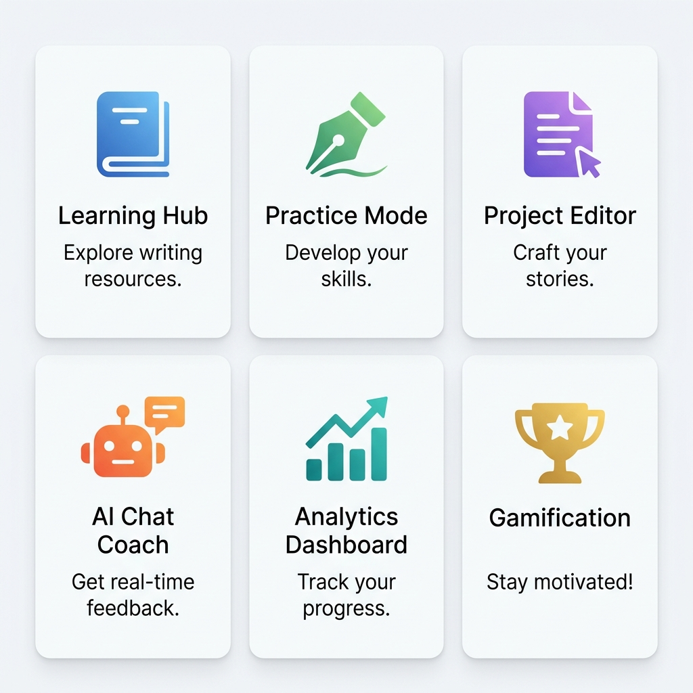
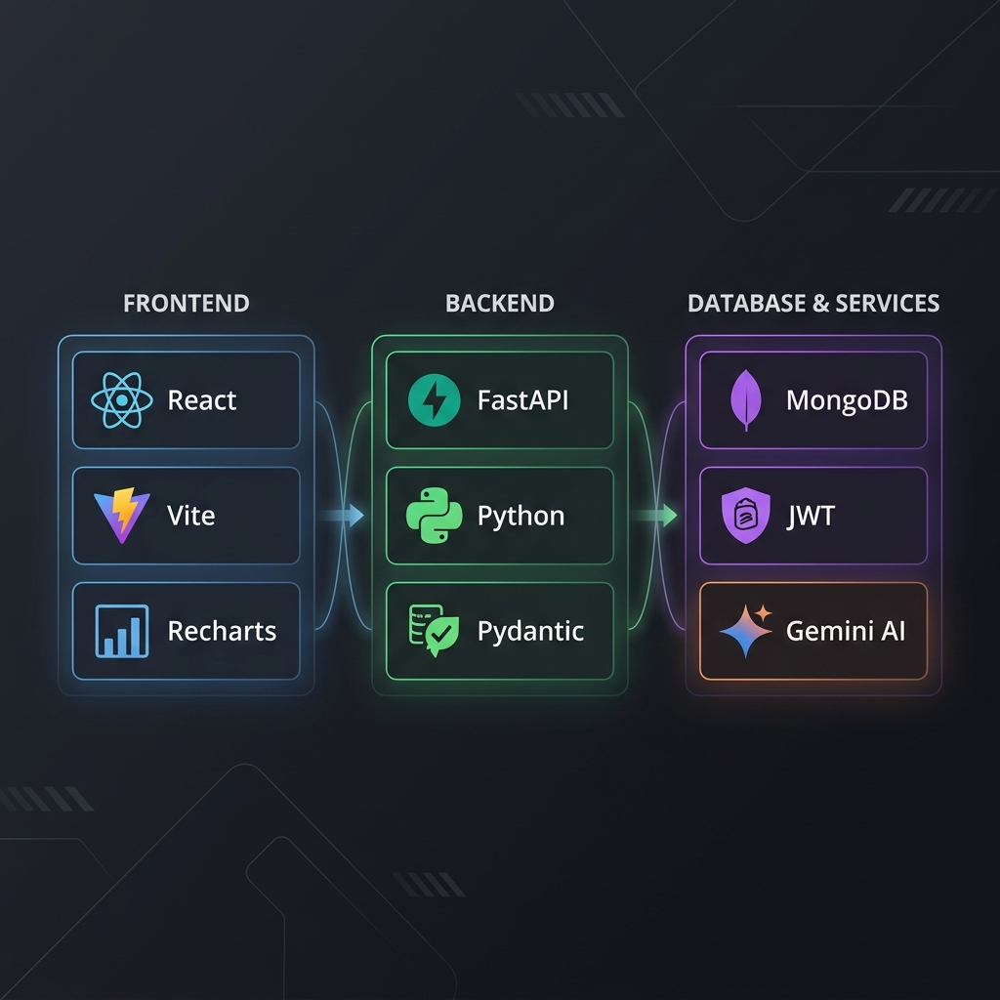

<p align="center">
  
</p>

<h1 align="center">✍️ WriteWisely</h1>

<p align="center">
  <strong>AI-Powered Writing Coach — Learn, Practice, Write, and Grow.</strong>
</p>

<p align="center">
  <a href="#-features"></a>
  <a href="#-tech-stack"></a>
  <a href="#-quick-start"></a>
  <a href="https://github.com/mujju-212/WriteWisely"></a>
  <a href="https://github.com/mujju-212/WriteWisely/graphs/contributors"></a>
</p>

<p align="center">
  <em>A comprehensive writing improvement platform that combines structured learning paths, real-time grammar analysis, AI-powered chat coaching, project editing, and rich progress analytics — all gamified with credits, streaks, and badges.</em>
</p>

---

## 📑 Table of Contents

- [✨ Features](#-features)
- [🖼️ Feature Overview](#️-feature-overview)
- [🛠️ Tech Stack](#️-tech-stack)
- [🏗️ Architecture](#️-architecture)
- [📁 Project Structure](#-project-structure)
- [🚀 Quick Start](#-quick-start)
- [⚙️ Environment Configuration](#️-environment-configuration)
- [📡 API Reference](#-api-reference)
- [📚 Content & Data](#-content--data)
- [🔧 Developer Utilities](#-developer-utilities)
- [🐛 Troubleshooting](#-troubleshooting)
- [🔒 Security Notes](#-security-notes)
- [👥 Contributors](#-contributors)
- [📄 License](#-license)

---

## ✨ Features

<p align="center">
  
</p>

### 📖 Learning Hub
A structured, level-based curriculum spanning **30 comprehensive levels** across Beginner, Intermediate, and Advanced tiers. Each level includes:
- Rich lesson content with examples and explanations
- Interactive quizzes with instant scoring
- Assignment submissions reviewed by AI
- Progressive unlocking system

### ✏️ Practice Mode
Two powerful practice workflows:
- **Live Hint Mode** — Real-time grammar and spelling suggestions as you type
- **Full Analysis Mode** — Complete writing evaluation with scoring, corrections, and detailed feedback

### 📝 Project Editor
A full-featured document editor for longer writing pieces:
- Create, save, and manage multiple writing projects
- Live AI-powered grammar suggestions while editing
- Document organization and version management

### 🤖 AI Chat Coach
An intelligent writing assistant that provides:
- Context-aware guidance based on your writing progress
- Document upload support (PDF/Text) for contextual analysis
- Multi-conversation management with history
- Cross-conversation reference capabilities

### 📊 Analytics Dashboard
A comprehensive 8-section analytics dashboard featuring:
- Overview stats cards (level, credits, accuracy, streak, words, time)
- Accuracy trend charts with 7-day visualization
- This week's activity breakdown
- Identified weak areas with practice recommendations
- Achievement badges showcase
- Exportable analytics data

### 🏆 Gamification System
Stay motivated with a rich reward system:
- **Credits** — Earn credits for completing lessons, quizzes, and practice tasks
- **Streaks** — Build daily streaks for consistent practice
- **10 Unique Badges** — From "First Steps" to "Legend" status
- **Leaderboard Ranking** — Track your position among other learners

### 🔐 Authentication & Security
Robust account management:
- JWT-based authentication with bcrypt password hashing
- OTP-based email verification via MailerSend
- Password reset with OTP verification
- Initial placement assessment to determine starting level

### 🔔 Notifications
Real-time notification system for:
- Achievement unlocks and badge earnings
- Streak milestones and reminders
- Learning progress updates

---

## 🛠️ Tech Stack

<p align="center">
  
</p>

| Layer | Technologies |
|:---:|:---|
| **Frontend** | React 18 · Vite 5 · Recharts · Lucide React · Font Awesome 7 · CSS3 |
| **Backend** | FastAPI · Pydantic v2 · Motor (async MongoDB) · PyMongo |
| **Database** | MongoDB (local or Atlas) |
| **Auth** | JWT (python-jose) · bcrypt · OTP via MailerSend |
| **AI / LLM** | Google Gemini (primary) · OpenRouter (fallback) · Hugging Face (fallback) |
| **File Processing** | PyPDF for PDF parsing · Text file context extraction |
| **Build Tools** | Vite · npm · pip · Python venv |

---

## 🏗️ Architecture

```
┌─────────────────────────────────────────────────────────────────┐
│                        CLIENT (Browser)                         │
│                                                                 │
│   React 18 + Vite 5          Recharts         Lucide/FA Icons   │
│   ┌────────────────┐   ┌──────────────┐   ┌────────────────┐   │
│   │   App Shell    │   │  Analytics   │   │   Dashboard    │   │
│   │  Auth / Dash   │   │   Charts     │   │   Components   │   │
│   └───────┬────────┘   └──────────────┘   └────────────────┘   │
│           │  API calls via fetch()                              │
│           │  Vite proxy: /api → localhost:8000                  │
└───────────┼─────────────────────────────────────────────────────┘
            │
            ▼
┌─────────────────────────────────────────────────────────────────┐
│                    SERVER (FastAPI + Uvicorn)                    │
│                                                                 │
│   ┌──────────────────────────────────────────────────────────┐  │
│   │                    Route Modules                         │  │
│   │  /api/auth    /api/learning   /api/practice              │  │
│   │  /api/project /api/chat       /api/checker               │  │
│   │  /api/analytics               /api/notifications         │  │
│   └──────────────────────────────────────────────────────────┘  │
│                                                                 │
│   ┌──────────┐  ┌──────────┐  ┌──────────┐  ┌──────────────┐  │
│   │ Services │  │  Models  │  │ Prompts  │  │  Middleware   │  │
│   │ (LLM,   │  │(Pydantic)│  │  (LLM    │  │  (JWT Auth)  │  │
│   │ email)  │  │          │  │ templates│  │              │  │
│   └────┬─────┘  └──────────┘  └──────────┘  └──────────────┘  │
│        │                                                        │
└────────┼────────────────────────────────────────────────────────┘
         │
         ▼
┌─────────────────────────────────┐    ┌──────────────────────────┐
│         MongoDB                 │    │     External APIs        │
│                                 │    │                          │
│  Collections:                   │    │  • Google Gemini API     │
│  • users                        │    │  • OpenRouter API        │
│  • error_logs                   │    │  • Hugging Face API      │
│  • practice_submissions         │    │  • MailerSend (email)    │
│  • projects                     │    │                          │
│  • chat_conversations           │    └──────────────────────────┘
│  • analytics_snapshots          │
│  • notifications                │
└─────────────────────────────────┘
```

---

## 📁 Project Structure

```
WriteWisely/
├── 📄 README.md                    # This file
├── 📄 setup.bat                    # Windows setup script (one-click)
├── 📄 setup.sh                     # Linux/Mac setup script (one-click)
├── 📄 .gitignore
│
├── 📂 docs/
│   └── 📂 images/                  # README images and assets
│       ├── banner.png
│       ├── features.png
│       └── tech_stack.png
│
├── 📂 backend/
│   ├── 📄 main.py                  # FastAPI app entry point
│   ├── 📄 config.py                # DB connection, env loading, Mongo recovery
│   ├── 📄 requirements.txt         # Python dependencies
│   ├── 📄 .env                     # Environment variables (not committed)
│   │
│   ├── 📂 routes/                  # API route handlers
│   │   ├── auth.py                 # Signup, login, OTP, password reset
│   │   ├── learning.py             # Levels, lessons, quizzes, assignments
│   │   ├── practice.py             # Practice templates, check, submit
│   │   ├── project.py              # CRUD for writing projects
│   │   ├── chat.py                 # AI chat with document context
│   │   ├── checker.py              # Grammar/spell check endpoint
│   │   ├── analytics.py            # Dashboard stats, overview, export
│   │   └── notifications.py        # User notifications
│   │
│   ├── 📂 services/                # Business logic & external integrations
│   ├── 📂 models/                  # Pydantic request/response models
│   ├── 📂 middleware/              # JWT auth middleware
│   ├── 📂 prompts/                 # LLM prompt templates
│   │
│   ├── 📂 data/                    # Static content (JSON-driven)
│   │   ├── 📂 lessons/             # Level 1-30 lesson content
│   │   ├── 📂 quizzes/             # Level 1-30 quiz questions
│   │   ├── practice_templates.json # 14 practice task templates
│   │   └── assessment_questions.json # Placement assessment
│   │
│   ├── 📄 seed_demo_account.py     # Seed a full demo account with data
│   ├── 📄 backfill_analytics.py    # Backfill analytics from history
│   ├── 📄 test_backend_full.py     # Comprehensive backend integration tests
│   └── 📄 _chat_e2e_stdlib.py      # Chat flow smoke test
│
└── 📂 frontend/
    ├── 📄 package.json             # Node dependencies & scripts
    ├── 📄 vite.config.js           # Vite config with API proxy
    ├── 📄 index.html               # HTML entry point
    │
    └── 📂 src/
        ├── 📄 App.jsx              # Root — auth vs authenticated routing
        ├── 📄 Auth.jsx             # Login/signup/OTP/reset flow
        │
        ├── 📂 pages/               # Full-page view components
        │   ├── Dashboard.jsx       # Main dashboard with stats & activity
        │   ├── LearningHome.jsx    # Learning levels overview
        │   ├── Lesson.jsx          # Individual lesson view
        │   ├── PracticeHome.jsx    # Practice template browser
        │   ├── PracticeEditor.jsx  # Practice writing interface
        │   ├── Projects.jsx        # Project list & editor
        │   ├── Analytics.jsx       # 8-section analytics dashboard
        │   ├── Assessment.jsx      # Placement assessment
        │   ├── Settings.jsx        # User settings
        │   └── ...                 # Auth-related pages
        │
        ├── 📂 components/          # Reusable UI components
        ├── 📂 services/            # API client & auth service
        ├── 📂 hooks/               # Custom React hooks
        ├── 📂 context/             # Theme & app context
        └── 📂 utils/               # Utility functions
```

---

## 🚀 Quick Start

### Prerequisites

| Requirement | Minimum Version | Download |
|:---|:---:|:---|
| **Python** | 3.10+ | [python.org](https://www.python.org/downloads/) |
| **Node.js** | 18+ | [nodejs.org](https://nodejs.org/) |
| **npm** | 9+ | Comes with Node.js |
| **MongoDB** | 6.0+ | [mongodb.com](https://www.mongodb.com/try/download/community) or use [Atlas](https://www.mongodb.com/atlas) |

### Option 1: One-Click Setup (Recommended) ⚡

The fastest way to get started. The setup script handles everything automatically.

**Windows:**
```bash
git clone https://github.com/mujju-212/WriteWisely.git
cd WriteWisely
setup.bat
```

**Linux / macOS:**
```bash
git clone https://github.com/mujju-212/WriteWisely.git
cd WriteWisely
chmod +x setup.sh
./setup.sh
```

The setup script will:
1. ✅ Verify Python, Node.js, and npm are installed
2. ✅ Create a Python virtual environment
3. ✅ Install all backend dependencies
4. ✅ Generate a `.env` template (if not exists)
5. ✅ Install all frontend dependencies

### Option 2: Manual Setup

#### Step 1 — Clone the Repository
```bash
git clone https://github.com/mujju-212/WriteWisely.git
cd WriteWisely
```

#### Step 2 — Backend Setup
```bash
cd backend

# Create and activate virtual environment
python -m venv venv

# Windows
venv\Scripts\activate

# Linux/macOS
source venv/bin/activate

# Install dependencies
pip install -r requirements.txt
```

#### Step 3 — Configure Environment
```bash
# Copy the template (or create your own)
cp .env.example .env    # Linux/macOS
copy .env.example .env  # Windows

# Edit .env and add your API keys
```

> **⚠️ Important:** You need at least one LLM API key (Gemini recommended) for AI features to work.

#### Step 4 — Frontend Setup
```bash
cd ../frontend
npm install
```

#### Step 5 — Start MongoDB
```bash
# If using local MongoDB, make sure the service is running:
# Windows: Start "MongoDB Server" from Services
# Linux: sudo systemctl start mongod
# macOS: brew services start mongodb-community

# Or set MONGODB_URL in .env to your Atlas connection string
```

#### Step 6 — Start the Application

**Terminal 1 — Backend:**
```bash
cd backend
venv\Scripts\activate        # Windows
# source venv/bin/activate   # Linux/macOS
uvicorn main:app --reload
```
Backend runs at → **http://localhost:8000**

**Terminal 2 — Frontend:**
```bash
cd frontend
npm run dev
```
Frontend runs at → **http://localhost:5173**

> Vite is configured to proxy `/api` requests to `http://localhost:8000` automatically.

#### Step 7 — (Optional) Seed Demo Data
```bash
cd backend
python seed_demo_account.py
```
This creates a demo account with pre-populated learning progress, practice history, and analytics data.

---

## ⚙️ Environment Configuration

Create a `backend/.env` file with the following configuration:

```env
# ═══════════════════════════════════════════════════════
#  CORE CONFIGURATION
# ═══════════════════════════════════════════════════════

MONGODB_URL=mongodb://localhost:27017/writewisely
JWT_SECRET=change-this-to-a-strong-random-secret
JWT_ALGORITHM=HS256
JWT_EXPIRY_HOURS=24

# ═══════════════════════════════════════════════════════
#  LLM PROVIDERS  (configure at least one)
# ═══════════════════════════════════════════════════════

# Provider 1: Google Gemini (recommended — primary)
GEMINI_API_KEY=your_gemini_api_key_here
GEMINI_MODEL=gemini-2.0-flash

# Provider 2: OpenRouter (fallback)
OPENROUTER_API_KEY=your_openrouter_key_here
LLM_MODEL=google/gemma-3-12b-it:free

# Provider 3: Hugging Face (fallback)
HF_API_KEY=your_huggingface_key_here
HF_MODEL=meta-llama/Llama-3.2-1B-Instruct

# ═══════════════════════════════════════════════════════
#  EMAIL / OTP
# ═══════════════════════════════════════════════════════

MAILERSEND_API_KEY=your_mailersend_key
MAILERSEND_DOMAIN=your_domain.com
SENDER_EMAIL=noreply@your_domain.com
SENDER_NAME=WriteWisely
ALLOW_OTP_DEV_FALLBACK=true    # Set to true for dev (OTP logged to console)

# ═══════════════════════════════════════════════════════
#  LOCAL MONGO RECOVERY (dev convenience)
# ═══════════════════════════════════════════════════════

AUTO_START_LOCAL_MONGO=true
LOCAL_MONGO_DBPATH=              # Leave empty for auto-detection
```

### Configuration Notes

| Variable | Purpose |
|:---|:---|
| `MONGODB_URL` | MongoDB connection string. Supports local or Atlas. |
| `JWT_SECRET` | **Must be changed** for production. Used to sign auth tokens. |
| `GEMINI_API_KEY` | Primary LLM provider. Get a free key at [aistudio.google.com](https://aistudio.google.com/) |
| `ALLOW_OTP_DEV_FALLBACK` | When `true`, OTPs are logged to console instead of sent via email |
| `AUTO_START_LOCAL_MONGO` | Backend auto-starts local `mongod` if connection fails (dev only) |

---

## 📡 API Reference

Base URL: `http://localhost:8000/api`

Interactive API docs (Swagger UI): **http://localhost:8000/docs**

<details>
<summary><strong>🔐 Auth Endpoints</strong> — <code>/api/auth</code></summary>

| Method | Endpoint | Description |
|:---:|:---|:---|
| `POST` | `/signup` | Create a new account |
| `POST` | `/verify-otp` | Verify email with OTP |
| `POST` | `/resend-otp` | Resend verification OTP |
| `POST` | `/login` | Authenticate and receive JWT |
| `POST` | `/logout` | Invalidate session |
| `POST` | `/forgot-password` | Request password reset OTP |
| `POST` | `/verify-reset-otp` | Verify reset OTP |
| `POST` | `/reset-password` | Set new password |
| `GET` | `/profile` | Get user profile |
| `PUT` | `/profile` | Update user profile |
| `PUT` | `/change-password` | Change password |
| `GET` | `/assessment-questions` | Get placement assessment |
| `POST` | `/submit-assessment` | Submit assessment answers |
| `DELETE` | `/delete-account` | Delete user account |

</details>

<details>
<summary><strong>📖 Learning Endpoints</strong> — <code>/api/learning</code></summary>

| Method | Endpoint | Description |
|:---:|:---|:---|
| `GET` | `/levels` | List all levels with progress |
| `GET` | `/levels/{level_id}` | Get level details & lesson content |
| `POST` | `/lesson/{level_id}/complete` | Mark lesson as completed |
| `POST` | `/quiz/{level_id}` | Submit quiz answers |
| `POST` | `/assignment/{level_id}` | Submit assignment for AI review |

</details>

<details>
<summary><strong>✏️ Practice Endpoints</strong> — <code>/api/practice</code></summary>

| Method | Endpoint | Description |
|:---:|:---|:---|
| `GET` | `/templates` | List all practice templates |
| `GET` | `/templates/{task_id}` | Get specific template details |
| `POST` | `/check` | Live grammar/spelling check |
| `POST` | `/submit` | Submit practice for full analysis |
| `GET` | `/history` | Get practice submission history |

</details>

<details>
<summary><strong>📝 Project Endpoints</strong> — <code>/api/project</code></summary>

| Method | Endpoint | Description |
|:---:|:---|:---|
| `GET` | `/list` | List all user projects |
| `POST` | `/create` | Create a new project |
| `GET` | `/{project_id}` | Get project content |
| `PUT` | `/{project_id}` | Update project content |
| `DELETE` | `/{project_id}` | Delete a project |

</details>

<details>
<summary><strong>🤖 Chat Endpoints</strong> — <code>/api/chat</code></summary>

| Method | Endpoint | Description |
|:---:|:---|:---|
| `POST` | `/upload-document` | Upload document for context |
| `GET` | `/documents` | List uploaded documents |
| `DELETE` | `/documents/{document_id}` | Remove a document |
| `GET` | `/history` | Get chat conversation history |
| `POST` | `/send` | Send message to AI coach |
| `DELETE` | `/clear` | Clear chat history |

</details>

<details>
<summary><strong>🔍 Checker Endpoint</strong> — <code>/api/checker</code></summary>

| Method | Endpoint | Description |
|:---:|:---|:---|
| `POST` | `/check` | Check text for grammar & spelling errors |

</details>

<details>
<summary><strong>📊 Analytics Endpoints</strong> — <code>/api/analytics</code></summary>

| Method | Endpoint | Description |
|:---:|:---|:---|
| `GET` | `/dashboard` | Full dashboard data |
| `GET` | `/overview` | Summary overview stats |
| `PUT` | `/settings` | Update analytics preferences |
| `GET` | `/export` | Export analytics data |

</details>

<details>
<summary><strong>🔔 Notification Endpoints</strong> — <code>/api/notifications</code></summary>

| Method | Endpoint | Description |
|:---:|:---|:---|
| `GET` | `/` | Get all notifications |
| `PATCH` | `/mark-read` | Mark specific notifications as read |
| `PATCH` | `/mark-all-read` | Mark all as read |

</details>

---

## 📚 Content & Data

All educational content is **JSON-driven** and located in `backend/data/`:

| File / Directory | Content |
|:---|:---|
| `data/lessons/level_01.json` — `level_30.json` | Structured lesson content for all 30 levels |
| `data/quizzes/level_01.json` — `level_30.json` | 10-question quizzes per level |
| `data/practice_templates.json` | 14 structured practice templates with LLM evaluation criteria |
| `data/assessment_questions.json` | Placement test (10 questions) to determine starting level |

### Adding New Content

To extend the curriculum, simply add new JSON files following the existing format:

```json
// Example: data/lessons/level_31.json
{
  "level_id": 31,
  "title": "Your New Lesson Title",
  "difficulty": "Advanced",
  "topic": "Writing",
  "sections": [
    {
      "heading": "Introduction",
      "content": "Lesson content here...",
      "examples": ["Example 1", "Example 2"]
    }
  ]
}
```

---

## 🔧 Developer Utilities

### Seed Demo Account
Populates a demo account with full learning progress, practice history, error logs, and analytics:
```bash
cd backend
python seed_demo_account.py
```

### Backfill Analytics
Generates analytics snapshots from existing historical data:
```bash
cd backend
python backfill_analytics.py
```

### Chat Smoke Test
End-to-end test for the AI chat pipeline:
```bash
cd backend
python _chat_e2e_stdlib.py
```

### Full Integration Tests
Comprehensive backend test suite covering all endpoints:
```bash
cd backend
python test_backend_full.py
```

---

## 🐛 Troubleshooting

<details>
<summary><strong>🔴 401 Unauthorized on Login</strong></summary>

**Common causes:**
- Wrong email or password
- Account exists but email not verified (`email_verified=false`)
- Backend connected to a different MongoDB data directory

**Quick check — verify users exist:**
```bash
cd backend
python -c "from pymongo import MongoClient; db=MongoClient('mongodb://localhost:27017/writewisely').get_default_database(); print(f'Users: {db.users.count_documents({})}')"
```

</details>

<details>
<summary><strong>🔴 MongoDB Connection Refused (WinError 10061)</strong></summary>

1. Ensure MongoDB service is running:
   - **Windows:** Open Services → Start "MongoDB Server"
   - **Linux:** `sudo systemctl start mongod`
   - **macOS:** `brew services start mongodb-community`
2. Verify `MONGODB_URL` in `backend/.env`
3. Enable `AUTO_START_LOCAL_MONGO=true` for automatic recovery in dev

</details>

<details>
<summary><strong>🔴 503 Database Unavailable</strong></summary>

- MongoDB is unreachable or startup failed
- Confirm port and connection string in `.env`
- Check backend console for detailed connection error logs
- Restart the backend after fixing MongoDB

</details>

<details>
<summary><strong>🟡 AI Features Not Working</strong></summary>

- Ensure at least one LLM API key is set in `backend/.env`
- **Gemini** is the primary provider — get a free key at [aistudio.google.com](https://aistudio.google.com/)
- The system automatically falls back to OpenRouter → Hugging Face if the primary fails
- Check backend console for LLM provider error messages

</details>

<details>
<summary><strong>🟡 OTP Not Received</strong></summary>

- For development, set `ALLOW_OTP_DEV_FALLBACK=true` in `.env`
- The OTP will be printed to the backend console
- For production, configure MailerSend API keys properly

</details>

---

## 🔒 Security Notes

> **⚠️ Important for Production Deployment**

- 🔑 **Never commit** real API keys or secrets — use `.env` files
- 🔄 **Rotate keys immediately** if they were accidentally exposed
- 🛡️ Use a **strong, random JWT_SECRET** (at least 32 characters)
- 🔐 Use **production-grade MongoDB credentials** with authentication enabled
- 🌐 Restrict **CORS origins** in `main.py` to your actual deployment domain
- 📧 Disable `ALLOW_OTP_DEV_FALLBACK` in production

---

## 👥 Contributors

<table>
  <tr>
    <td align="center">
      <a href="https://github.com/mujju-212">
        
        <br />
        <sub><b>Mujutaba M N</b></sub>
      </a>
      <br />
      <sub>🏆 Project Lead & Core Developer</sub>
      <br />
      <a href="https://github.com/mujju-212"></a>
    </td>
    <td align="center">
      <a href="https://github.com/Ashlesh25-art">
        
        <br />
        <sub><b>Ashlesh</b></sub>
      </a>
      <br />
      <sub>💻 Developer</sub>
      <br />
      <a href="https://github.com/Ashlesh25-art"></a>
    </td>
    <td align="center">
      <a href="https://github.com/nandeeshbm">
        
        <br />
        <sub><b>Nandeesh BM</b></sub>
      </a>
      <br />
      <sub>💻 Developer</sub>
      <br />
      <a href="https://github.com/nandeeshbm"></a>
      <a href="https://www.linkedin.com/in/nandeesh-bm-696546301"></a>
    </td>
    <td align="center">
      <a href="https://github.com/SKDARSHAN22">
        
        <br />
        <sub><b>SK Darshan (SKDARSHAN22)</b></sub>
      </a>
      <br />
      <sub>💻 Developer</sub>
      <br />
      <a href="https://github.com/SKDARSHAN22"></a>
    </td>
  </tr>
</table>

---

## 📄 License

This project is currently unlicensed. If you intend reuse, please add a `LICENSE` file (e.g., [MIT](https://choosealicense.com/licenses/mit/)).

---

<p align="center">
  <strong>Made with ❤️ by the WriteWisely Team</strong>
  <br />
  <em>Empowering better writing, one lesson at a time.</em>
</p>

<p align="center">
  <a href="#️-writewisely">⬆ Back to Top</a>
</p>
